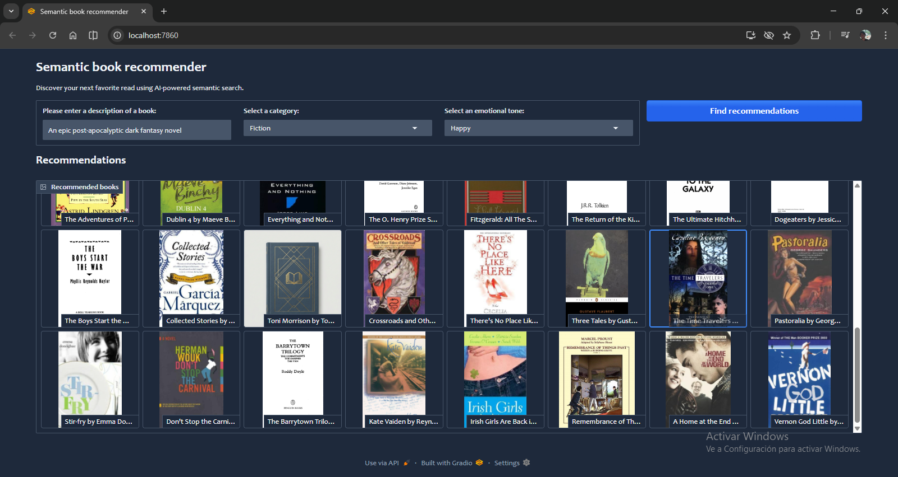
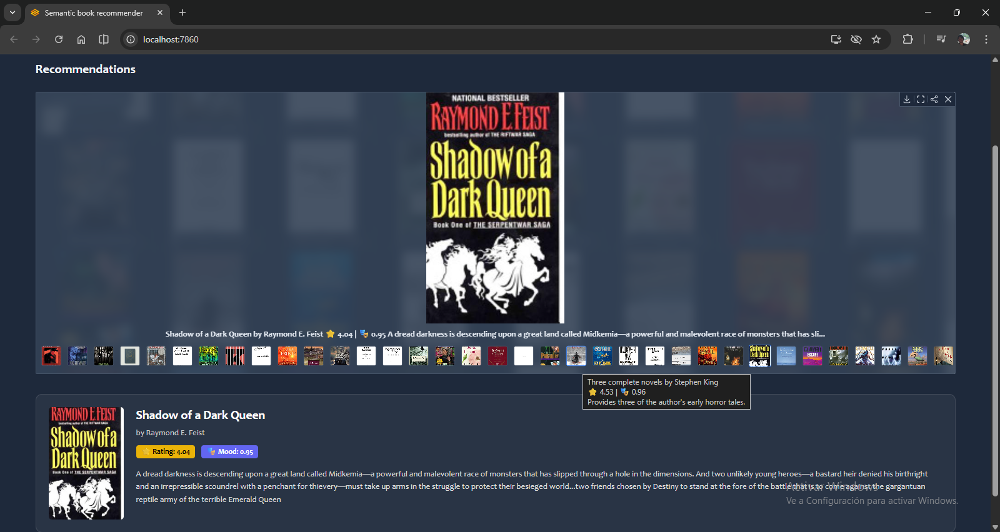
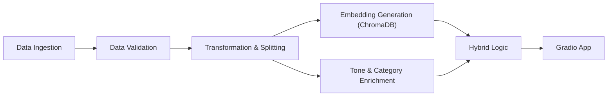

# Hybrid Book Recommender: Semantic & Emotional Search 📚✨

[](https://www.python.org/downloads/release/python-3120/)
[](https://dvc.org/)
[](https://mlflow.org/)
[](https://gradio.app/)
[](https://opensource.org/licenses/MIT)

A production-grade **End-to-End MLOps System** that recommends books not just by genre, but by **meaning** and **emotional tone**. Built with a focus on reproducibility, scalability, and modern software engineering practices.

---

## 📸 Interface Preview

Experience a modern, glassmorphic UI designed for discovery.

| Search Dashboard | Detailed Recommendations |
| :---: | :---: |
|  |  |

---

## 🚀 Key Features

*   **Hybrid Intelligence:** Combines **Vector Search** (Semantic meaning) with **Keyword Filtering** (Genre) and **Tone Analysis** (Emotional vibe).
*   **Emotional Context:** Uses a Transformer-based classifier (`distilroberta-base`) to detect emotions (Joy, Suspense, Sadness) in book descriptions.
*   **Vector Database:** Powered by **ChromaDB** for millisecond-latency similarity searches.
*   **Zero-Shot Enrichment:** Automatically tags books with simplified categories using BART-Large-MNLI.
*   **Robust MLOps:**
    *   **DVC:** Fully reproducible data and model pipelines with DAG execution.
    *   **MLflow:** Experiment tracking for model metrics and parameters.
    *   **Docker:** Containerized for easy deployment.
    *   **CI/CD:** Automated testing and checks.

---

## 🛠️ The Tech Stack

*   **Core:** Python 3.12, LangChain, `uv` (Dependency Manager)
*   **Orchestration:** DVC (Data Version Control)
*   **Tracking:** MLflow
*   **Database:** ChromaDB (Vector Store)
*   **Models:** Hugging Face Transformers, Google Gemini (Embeddings & LLM)
*   **UI:** Gradio (Web Interface)
*   **Testing:** Pytest

---

## 🏗️ Architecture & Workflow

The system follows a strict **Directed Acyclic Graph (DAG)** pipeline managed by DVC:



For a detailed breakdown of the pipeline stages, read the [**DVC Pipeline Report**](reports/docs/dvc_pipeline_report.md).

---

## 💻 Installation & Usage

### Prerequisites
*   Python 3.12+
*   `uv` installed (`pip install uv`)

### 1. Clone & Setup
```bash
git clone https://github.com/SebastianGarrido2790/hybrid-book-recommender.git
cd hybrid-book-recommender

# Install dependencies insanely fast with uv
uv sync
```

### 2. Run the MLOps Pipeline
Reproduce the entire experiment from raw data to trained VectorDB:
```bash
uv run dvc repro
```
*DVC will intelligently skip stages if inputs haven't changed.*

### 3. Launch the App
Start the local server:
```bash
uv run python app.py
```
Access the UI at: `http://localhost:7860`

---

## 📂 Project Structure

We follow a modular, component-based architecture.

```text
hybrid-book-recommender/
├── .dvc/                   # DVC Config
├── .github/                # CI/CD Workflows
├── app.py                  # Gradio Application Entrypoint
├── artifacts/              # Pipeline Artifacts (Gitignored)
├── config/                 # Centralized Configuration (YAML)
├── dvc.yaml                # Pipeline Definition (DAG)
├── mlruns/                 # MLflow Local storage
├── src/
│   ├── components/         # Core Logic (Ingestion, Training, etc.)
│   ├── entity/             # Data Classes (Type Safety)
│   ├── models/             # Recommender Engine Logic
│   ├── pipeline/           # Orchestration Scripts
│   └── utils/              # Shared Utilities (Logging, Common)
└── ...
```

See [Folder Structure](references/folder_structure.md) for details.

---

## 🧩 Reproduction

To replicate the exact results:
1.  **Pull Artifacts:** `uv run dvc pull` (if remote is configured).
2.  **Repro Pipeline:** `uv run dvc repro`.
3.  **Check Metrics:** `uv run mlflow ui`.

---

## 📜 License

Distributed under the MIT License. See `LICENSE.txt` for more information.

---
*Built with ❤️ by Sebastian Garrido for the Advanced Agentic Coding Portfolio.*
