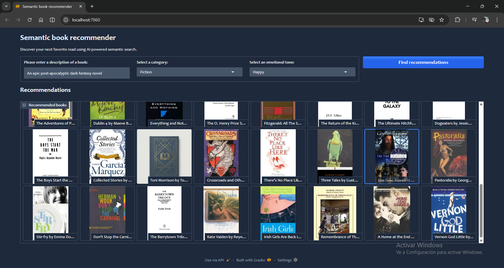
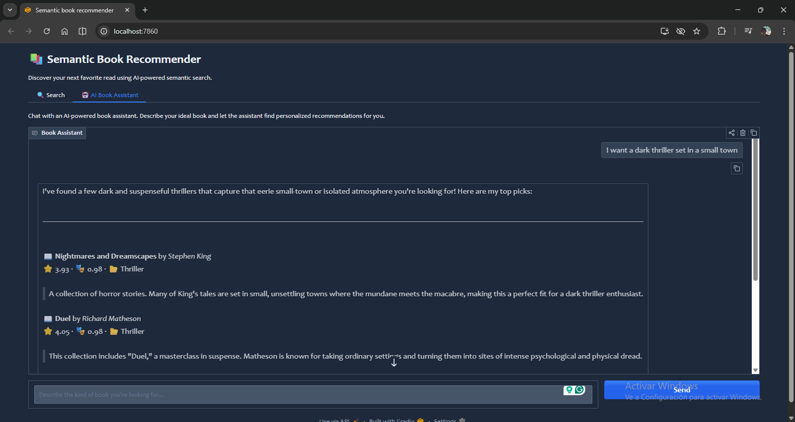
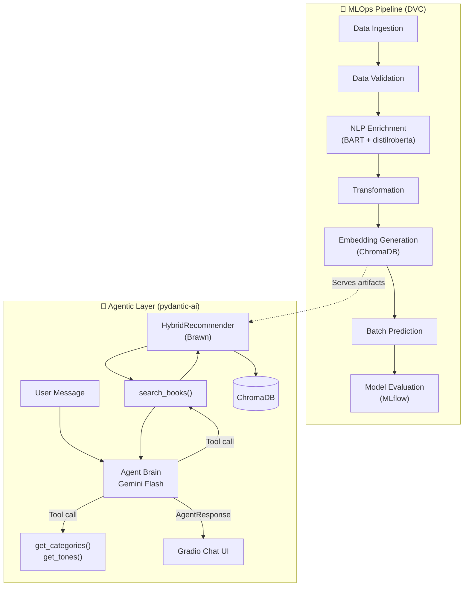

# Hybrid Book Recommender: Agentic Semantic Search 📚🤖

[](https://www.python.org/downloads/release/python-3110/)
[](https://ai.pydantic.dev/)
[](https://ai.google.dev/)
[](https://dvc.org/)
[](https://mlflow.org/)
[](https://gradio.app/)
[](https://opensource.org/licenses/MIT)

A production-grade **Agentic MLOps System** that evolves beyond static search — it *reasons* about what you want. Combining a conversational **Google Gemini Agent** with a deterministic **Hybrid Semantic + Emotional Search Engine**, it recommends books by meaning, mood, and natural conversation.

---

## 📸 Interface Preview

Two powerful interfaces, one system.

| 🔍 Semantic Search Tab | 🤖 AI Book Assistant Tab |
| :---: | :---: |
|  |  |

The **Semantic Search** tab allows you to search for books by title, author, or keywords. It returns a list of books that match your query, ranked by relevance.

The **AI Book Assistant** accepts natural language like *"I want a dark thriller set in a small town"* and returns curated, conversational recommendations with follow-up suggestions to refine your taste.

---

## 🚀 Key Features

*   **🤖 Conversational AI Agent:** A `pydantic-ai` ReAct agent powered by **Google Gemini Flash** reasons about user preferences and orchestrates searches in natural language.
*   **Structured Output Enforcement:** All agent responses are validated Pydantic models — the LLM never hallucinates book data, only reasons about *which* tool calls to make.
*   **Hybrid Intelligence:** Combines **Vector Search** (semantic meaning) with **Genre Filtering** and **Tone Analysis** (emotional vibe) in a single scored result.
*   **Emotional Context:** A Transformer-based classifier (`distilroberta-base`) detects emotions (Joy, Suspense, Sadness) at the sentence level for nuanced filtering.
*   **Vector Database:** Powered by **ChromaDB** for millisecond-latency similarity searches.
*   **Zero-Shot Enrichment:** Automatically tags books into simplified categories using BART-Large-MNLI — no labeled training data required.
*   **Robust MLOps Backbone:**
    *   **DVC:** Fully reproducible 8-stage pipeline with `deps`, `params`, `outs`, and `metrics`.
    *   **MLflow:** Experiment tracking with a SQLite backend — zero-config local usage.
    *   **Docker:** Multi-stage containerization with GHCR publishing.
    *   **CI/CD:** GitHub Actions with `pyright` + `ruff` + `pytest` + coverage gates + EC2 deploy.
    *   **Data Contracts:** `config/schema.yaml` enforces column-level validation across all pipeline stages.

---

## 🛠️ The Tech Stack

| Layer | Technology |
|:---|:---|
| **Agent Framework** | `pydantic-ai` — lightweight, native Pydantic structured output |
| **LLM Provider** | Google Gemini Flash (`gemini-flash-latest`) |
| **Embeddings** | HuggingFace `all-MiniLM-L6-v2` — local, privacy-safe, deterministic |
| **Vector Store** | ChromaDB — persistent, millisecond-latency semantic search |
| **NLP Enrichment** | BART-Large-MNLI (zero-shot) + `distilroberta-base` (tone) |
| **Pipeline Orchestration** | DVC (8-stage DAG) |
| **Experiment Tracking** | MLflow + SQLite backend |
| **UI** | Gradio 6.3+ (dual-tab: Search + AI Assistant) |
| **Config Management** | Pydantic `BaseModel` with `extra="forbid"` entities from YAML |
| **Dependency Manager** | `uv` — 10-100× faster than pip |
| **Code Quality** | `ruff` (lint + format) + `pyright` (strict types) + `pre-commit` |
| **Containerization** | Docker multi-stage + GitHub Container Registry |
| **Runtime** | Python 3.11 |

---

## 🏗️ System Architecture

The system combines a **deterministic MLOps backbone** with an **Agentic reasoning layer**:


```mermaid
flowchart TD
    subgraph Pipeline ["🔧 MLOps Pipeline  (DVC)"]
        Ingest["Data Ingestion"] --> Validate["Data Validation"]
        Validate --> Enrich["NLP Enrichment\n(BART + distilroberta)"]
        Enrich --> Transform["Transformation"]
        Transform --> Train["Embedding Generation\n(ChromaDB)"]
        Train --> Predict["Batch Prediction"]
        Predict --> Eval["Model Evaluation\n(MLflow)"]
    end

    subgraph Agent ["🤖 Agentic Layer  (pydantic-ai)"]
        User["User Message"] --> AgentBrain["Agent Brain\nGemini Flash"]
        AgentBrain -->|Tool call| SearchTool["search_books()"]
        AgentBrain -->|Tool call| MetaTool["get_categories()\nget_tones()"]
        SearchTool --> HybridRec["HybridRecommender\n(Brawn)"]
        HybridRec --> ChromaDB[("ChromaDB")]
        HybridRec --> SearchTool
        SearchTool --> AgentBrain
        AgentBrain -->|AgentResponse| ChatUI["Gradio Chat UI"]
    end

    Train -.->|"Serves artifacts"| HybridRec
```

For the full component-level architecture, see the [**Agentic Layer Report**](reports/docs/architecture/agentic_layer.md).

---

## 💻 Installation & Usage

### Prerequisites
*   Python 3.11+
*   `uv` installed: `pip install uv`
*   A `GOOGLE_API_KEY` from [Google AI Studio](https://aistudio.google.com/) (required for the AI Assistant tab and embeddings)

### 1. Clone & Setup
```bash
git clone https://github.com/SebastianGarrido2790/hybrid-book-recommender.git
cd hybrid-book-recommender

# Install all dependencies (including dev tools)
uv sync
```

### 2. Configure Environment
```bash
# Copy the example and fill in your key
cp .env.example .env
# Edit .env and set: GOOGLE_API_KEY=your_actual_key
```

### 3. Run the MLOps Pipeline
Reproduce the entire experiment from raw data to a populated VectorDB:
```bash
uv run dvc repro
```
*DVC intelligently skips stages whose inputs haven't changed.*

### 4. Launch the App

**One-click (Windows):**
```bash
.\launch_recommender.bat
```

**Manual:**
```bash
uv run python -m src.app.main
```
Access the UI at: `http://localhost:7860`

> **Tip:** Use `.\validate_recommender.bat` to run the full 4-pillar health check (Pyright → Ruff → Pytest → Gradio ping) before launching.

---

## 🤖 Agentic Layer

The **AI Book Assistant** tab is powered by a `pydantic-ai` ReAct agent following the **Brain vs. Brawn** principle:

| Role | Component | Responsibility |
|:---|:---|:---|
| 🧠 **Brain** | Gemini Flash Agent | Reasons about preferences, decides which tool to call, synthesizes response |
| 💪 **Brawn** | `HybridRecommender` | Executes deterministic vector search + scoring — never touched by the LLM |

**How it works:**

Refer to [**Agentic Layer Implementation**](reports/docs/workflows/agentic_layer_implementation.md) for the full implementation details.

1. User sends: *"I want a dark thriller set in a small town"*
2. Agent extracts intent → calls `search_books(query=..., tone="Suspenseful")`
3. `HybridRecommender` queries ChromaDB + applies hybrid scoring
4. Agent receives `list[BookRecommendation]` (Pydantic-validated)
5. Agent crafts a conversational response + 3 follow-up refinement suggestions
6. `AgentResponse` (fully typed) is rendered as styled book cards in Gradio

All outputs are validated `AgentResponse(BaseModel)` objects — the LLM is never allowed to free-text hallucinate book titles or ratings. See the full design in [**Agentic Layer Architecture**](reports/docs/architecture/agentic_layer.md).

---

## 🧩 Reproduction

To replicate the exact results:
1.  **Pull Artifacts:** `uv run dvc pull` (if a DVC remote is configured).
2.  **Repro Pipeline:** `uv run dvc repro`.
3.  **Check Metrics:** `uv run mlflow ui` → open `http://localhost:5000`.
4.  **Validate System:** `.\validate_recommender.bat`.

---

## 📜 License

Distributed under the MIT License. See [`LICENSE.txt`](LICENSE.txt) for more information.

---
*Built with ❤️ by Sebastian Garrido for the Advanced Agentic Coding Portfolio.*
