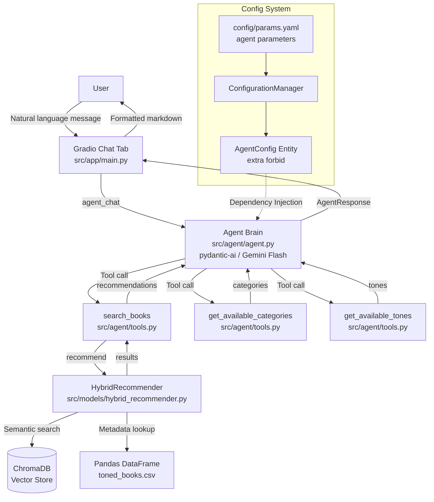

# Agentic Layer Architecture Report

*Last updated: 2026-03-26 | System version: v1.3*

---

## 1. Executive Summary

The Agentic Layer transforms the Hybrid Book Recommender from a **static search tool** into a **conversational AI system**. It introduces a `pydantic-ai` ReAct agent that reasons about user preferences in natural language, orchestrates the deterministic `HybridRecommender` engine as a tool, and returns fully validated, structured responses to the Gradio chat UI.

This layer directly fulfills the **Agentic Data Scientist** approach: the Agent is the Brain, the `HybridRecommender` is the Brawn. The LLM never hallucinates book data — it exclusively reasons about *which tool calls to make* and *how to present validated results conversationally*.

---

## 2. Design Principles Applied

| Rule | Application |
|---|---|
| **Brain vs. Brawn** | Agent reasons; `HybridRecommender` executes. LLM never performs math or data lookup. |
| **Structured Output** | All agent responses returned as validated `AgentResponse(BaseModel)` — never free text. |
| **No Naked Prompts** | System prompt versioned in `src/agent/prompts.py` as `BOOK_RECOMMENDER_SYSTEM_PROMPT v1.0.0`. |
| **Better Prompting** | Every tool carries a rich docstring the LLM reads at runtime to understand capabilities. |
| **Agent as a Tool Pattern** | Primary agent retains full state control; sub-tools are stateless, deterministic functions. |
| **Cost Optimization** | Uses `gemini-2.0-flash` (fast, cost-efficient) for routing and reasoning. |

---

## 3. File Structure

```
src/agent/
├── __init__.py          # Package marker
├── schemas.py           # Pydantic structured output models
├── prompts.py           # Versioned system prompt constants
├── tools.py             # Deterministic tool functions + AgentDependencies dataclass
└── agent.py             # Agent definition, chat() function, dependency factory
```

---

## 4. Architecture Diagram



---

## 5. Key Components

### 5.1 `AgentDependencies` — Dependency Injection Container

```python
@dataclass
class AgentDependencies:
    recommender: HybridRecommender   # The inference engine
    categories:  list[str]           # Available genre filters
    tones:       list[str]           # Available mood filters
    tone_map:    dict[str, str]      # Display name → internal label
    max_results: int                 # Capped by params.yaml
```

Dependencies are created **once at first request** via `create_agent_dependencies()` (lazy singleton), then injected into every agent run via `pydantic-ai`'s `RunContext` pattern. This avoids costly re-initialization of the `HybridRecommender` (ChromaDB connection + CSV load) on every chat message.

### 5.2 Structured Output Schemas

All agent outputs are validated by Pydantic before reaching the UI. `extra="forbid"` is mandatory on all models:

```python
class BookRecommendation(BaseModel):
    model_config = ConfigDict(extra="forbid")
    title:       str
    authors:     str
    description: str
    rating:      float
    mood_score:  str
    category:    str

class AgentResponse(BaseModel):
    model_config = ConfigDict(extra="forbid")
    message:               str
    recommendations:       list[BookRecommendation]
    follow_up_suggestions: list[str]
```

### 5.3 Versioned System Prompt (v1.0.0)

The system prompt in `src/agent/prompts.py` is a versioned constant. It constrains the agent to:

1. **Always** call `search_books` before recommending — never hallucinate titles.
2. Map user mood descriptions to available tone filters.
3. Present results conversationally with 2-3 follow-up suggestions.
4. Handle no-results gracefully by suggesting strategy refinements.

Prompt version is tracked by `PROMPT_VERSION = "1.0.0"` — increment this whenever prompt logic changes.

### 5.4 Tools (The Brawn)

| Tool | Inputs | Output | Purpose |
|---|---|---|---|
| `search_books` | `query: str`, `category: str\|None`, `tone: str\|None` | `list[BookRecommendation]` | Wraps `HybridRecommender.recommend()` |
| `get_available_categories` | *(none)* | `list[str]` | Exposes valid category filter values |
| `get_available_tones` | *(none)* | `list[str]` | Exposes valid tone filter values |

Tools are **stateless and deterministic** — the same input always produces the same output, making them testable without LLM involvement.

### 5.5 Agent Model Configuration

```yaml
# config/params.yaml
agent:
  model_name: gemini-2.0-flash   # Cost-efficient reasoning model
  temperature: 0.7               # Balanced creativity/determinism
  max_results_per_search: 5      # Capped to avoid UI overload
```

> [!NOTE]
> `model_name` and `temperature` are in `params.yaml` but not yet wired into the `GoogleModel` constructor — the agent currently uses the default provider temperature. This is a planned improvement for v1.4 (see §9).

---

## 6. Request Lifecycle

```
User types: "I want a dark thriller set in a small town"
              │
              ▼
agent_chat(user_message, history)       # src/app/main.py
              │
              ▼
book_agent.run_sync(message, deps=deps) # pydantic-ai agent
              │
    ┌─────────┴──────────┐
    │ LLM Reasoning Step  │
    │ → Extracts: theme="dark thriller", location="small town"
    │ → Decides: call search_books(query=..., tone="Suspenseful")
    └─────────────────────┘
              │
              ▼
search_books(ctx, "dark thriller small town", tone="Suspenseful")
              │
              ▼
recommender.recommend(query=..., tone_filter="fear")
              │
    ┌─────────┴──────────┐
    │ ChromaDB Semantic   │
    │ Search (top-K×3)   │
    │ + Hybrid Scoring   │
    │ + Tone Filtering   │
    └─────────────────────┘
              │ list[RecommendationResult]
              ▼
[BookRecommendation, ...] returned to Agent
              │
    ┌─────────┴──────────────────┐
    │ LLM Synthesis Step         │
    │ → Crafts conversational    │
    │   message                  │
    │ → Generates follow-ups     │
    └────────────────────────────┘
              │
              ▼
AgentResponse (Pydantic-validated)
              │
              ▼
_format_agent_response() → Markdown + book cards
              │
              ▼
gr.Chatbot UI rendered
```

---

## 7. Error Handling & Resilience

The agent layer has two defensive fallback mechanisms:

1. **Dependency Init Failure** — If `create_agent_dependencies()` fails (e.g., ChromaDB not built yet), the chat tab returns a user-friendly message directing users to the Search tab. The error is captured by the logger with full traceback via `CustomException`.

2. **Agent Execution Failure** — If `book_agent.run_sync()` raises (e.g., API rate-limit, malformed LLM output), `chat()` catches the exception and returns a safe fallback `AgentResponse` with an error message, ensuring Gradio never crashes.

---

## 8. Future Improvements (v1.4+)

| Item | Priority | Description |
|---|---|---|
| **Wire temperature to AgentConfig** | Medium | Pass `temperature` from `AgentConfig` to `GoogleModel` provider settings |
| **Conversation history** | High | Pass `message_history` to `run_sync()` for multi-turn coherence |
| **Streaming responses** | Medium | Use `run_stream_sync()` for progressive token display in `gr.Chatbot` |
| **AgentOps tracing** | Medium | Log tool call counts, latency, and retry rates |
| **LLM-as-a-Judge evals** | Low | Automated evaluation of recommendation quality via a judge agent |
| **HITL for sensitive queries** | Low | Add human-in-the-loop approval for edge cases |

---

## 9. Test Coverage

```
tests/unit/test_agent.py — 7 tests (all passing)
├── test_book_recommendation_valid            → Schema accepts valid data
├── test_book_recommendation_rejects_extra_fields → extra="forbid" enforced
├── test_agent_response_valid                 → Nested schema validates
├── test_agent_response_rejects_extra_fields  → extra="forbid" enforced
├── test_agent_response_defaults              → Optional lists default to []
├── test_get_categories_returns_config        → Tool reads from deps correctly
└── test_get_tones_returns_config             → Tool reads from deps correctly
```

> [!NOTE]
> The `search_books` tool is not directly unit-tested here because it depends on `HybridRecommender`, which is already covered by `test_recommender.py`. A dedicated `test_search_books_tool` test is planned for v1.4.

---

*This document is part of the Hybrid Book Recommender architecture portfolio. See also:*
- [Hybrid Inference Engine](./hybrid_inference.md)
- [DVC Pipeline Report](./dvc_pipeline_report.md)
- [UI Implementation Plan](../workflows/ui_implementation_plan.md)
