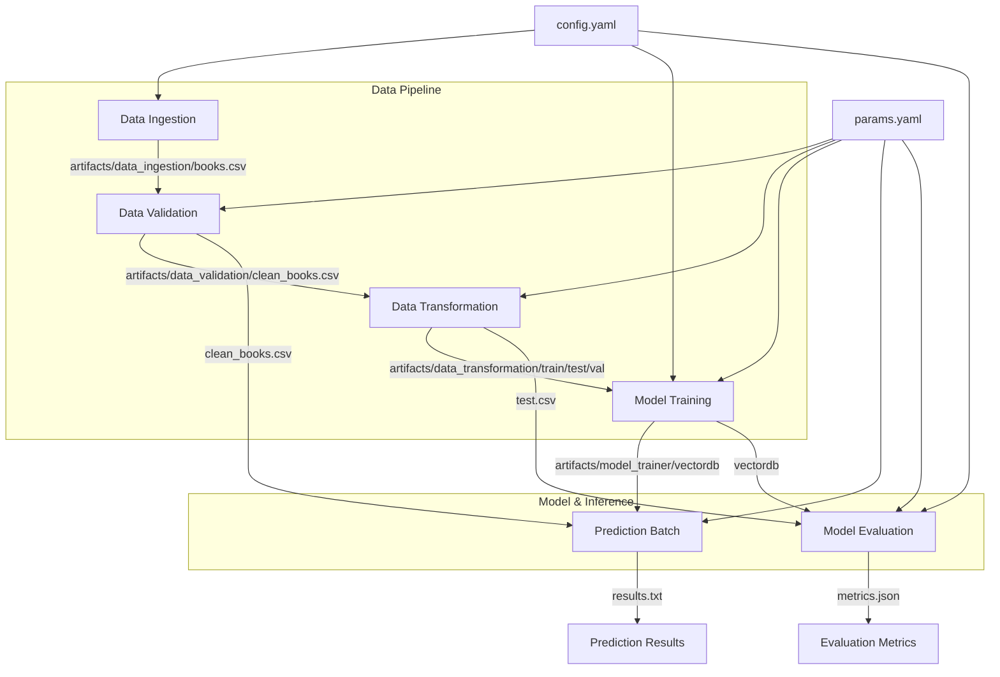

# DVC Pipeline Architecture Report

## 1. Overview
The Data Version Control (DVC) pipeline is the backbone of our **MLOps architecture**. Unlike a standard script, the DVC pipeline defines a **Directed Acyclic Graph (DAG)** where each stage is a node with strict inputs (dependencies) and outputs (artifacts).

This specific pipeline orchestrates the entire lifecycle of the **Hybrid Book Recommender**, from raw data ingestion to model evaluation, ensuring **reproducibility** and **efficiency** through intelligent caching.

### Why is this Critical for MLOps?
*   **Reproducibility:** Every run is tied to specific versions of data and code. `dvc.lock` captures the exact state (MD5 hashes) of dependencies, allowing any team member to reproduce results exactly.
*   **Smart Execution (Caching):** DVC checks if dependencies have changed. If inputs (e.g., `config.yaml` or source code) haven't changed, DVC skips the stage and uses cached outputs, saving massive computation time on heavy tasks like Embedding Generation.
*   **Experiment Tracking:** Integrates seamlessly with tools like MLflow to link code versions to metric performance.

## 2. Pipeline Visualization (Mermaid Flow)
The following diagram illustrates the dependency flow defined in `dvc.yaml`.



## 3. Stage Breakdown

The pipeline consists of 6 sequential stages defined in `dvc.yaml`:

### Stage 01: Data Ingestion
*   **Command:** `python -m src.pipeline.stage_01_ingestion`
*   **Purpose:** Downloads the raw Book Dataset from the source URL and extracts it.
*   **Dependencies:** Source URL in config.
*   **Output:** `artifacts/data_ingestion/books.csv`

### Stage 02: Data Validation
*   **Command:** `python -m src.pipeline.stage_02_validation`
*   **Purpose:** validatesthe schema of the incoming data, checks for missing values, and filters low-quality entries (e.g., short descriptions).
*   **Important:** Acts as a quality gate. If data is corrupt, the pipeline fails here, preventing wasted training time.
*   **Output:** `artifacts/data_validation/clean_books.csv`

### Stage 03: Data Transformation
*   **Command:** `python -m src.pipeline.stage_03_transformation`
*   **Purpose:** Splits the clean data into Training, Validation, and Test sets based on `params.yaml` (test_size, val_size).
*   **Output:** `artifacts/data_transformation` directory containing splits.

### Stage 04: Model Training (Embedding Generation)
*   **Command:** `python -m src.pipeline.stage_04_training`
*   **Purpose:** This is the core "training" phase. Note that since we use a pre-trained Sentence Transformer, "training" here refers to **Generating Embeddings** for the corpus and indexing them into **ChromaDB**.
*   **Output:** `artifacts/model_trainer/vectordb` (The Vector Database).

### Stage 05: Prediction (Batch Inference)
*   **Command:** `python -m src.pipeline.stage_05_prediction`
*   **Purpose:** Runs a batch of predefined queries against the newly trained system to ensure it generates valid output. Acts as a sanity check for the inference engine.
*   **Output:** `artifacts/prediction/results.txt`

### Stage 06: Model Evaluation
*   **Command:** `python -m src.pipeline.stage_06_evaluation`
*   **Purpose:** rigorously evaluates the recommender using the Test Set. It logs parameters (top_k, weights) and metrics to **MLflow**.
*   **Output:** `artifacts/model_evaluation/metrics.json`

---

## 4. DVC Pipeline vs. main.py

While both methods execute the project code, they serve distinct purposes in the MLOps lifecycle.

| Feature | **DVC Pipeline (`dvc repro`)** | **Python Script (`python main.py`)** |
| :--- | :--- | :--- |
| **Logic** | **Dependency-Aware.** Checks MD5 hashes of file dependencies. | **Sequential.** Runs every line of code from top to bottom. |
| **Execution** | **Lazy.** Only runs stages where inputs have changed. Skips others. | **Eager.** Re-runs EVERYTHING. Re-downloads data, re-trains models. |
| **Use Case** | **Production & Development.** The standard way to reproduce experiments. | **Debugging & Testing.** Used when you force a full run or debug flow logic. |
| **Artifacts** | Updates `dvc.lock` to snapshot the experiment state. | Does not interact with DVC locking mechanism. |
| **Parallelism** | Can potentially run independent stages in parallel (if DAG allows). | Strictly serial execution. |

### When to use which?

#### ✅ **Use `dvc repro` (Recommended)**
*   When iterating on a specific stage (e.g., tuning `model_trainer`). DVC will efficiently skip Ingestion/Validation if those files haven't changed.
*   When you want to record an experiment (updates `dvc.lock`).
*   When pushing to CI/CD pipelines.

#### ⚠️ **Use `uv run python main.py`**
*   When you want to **Force** a complete re-execution of the entire pipeline from scratch, ignoring all caches.
*   When checking if the Python imports and orchestrator logic work without DVC interception.
*   For quick, "dirty" runs where version control isn't the priority.

---

## 5. How to Reproduce Results Exactly

One of the primary benefits of DVC is the ability for any team member to clone the repository and reproduce the exact state of an experiment, down to the last byte of data and model weights.

### Step-by-Step Reproduction Guide

#### 1. Clone the Repository
Start by cloning the git repository and navigating into it.
```bash
git clone <repo_url>
cd hybrid-book-recommender
```

#### 2. Install Dependencies
Ensure you have the correct python environment. We use `uv` for fast dependency management.
```bash
uv sync
```

#### 3. Pull Data and Artifacts (DVC Pull)
Instead of re-running expensive training, you can simply pull the pre-computed artifacts (data, embeddings, models) associated with the current commit's `dvc.lock` file.
*Note: This requires that a remote storage (s3, gdrive, etc.) has been configured.*
```bash
uv run dvc pull
```
*If no remote is set up yet, DVC will just prepare to track local files.*

#### 4. Reproduce the Pipeline (DVC Repro)
To verify the integrity of the pipeline or run any pending stages:
```bash
uv run dvc repro
```
*   **Scenario A (No Changes):** If your code and data matches `dvc.lock`, DVC will output `Data and pipelines are up to date.` and do nothing.
*   **Scenario B (Changes):** If you modified a file (e.g., `src/model/hybrid_recommender.py`), DVC will detect the change and **only re-run the affected downstream stages** (Prediction and Evaluation), skipping Ingestion and Training.

#### 5. Review Experiment State
Check the DVC status to see if your workspace is in sync with the tracked experiment.
```bash
uv run dvc status
```

