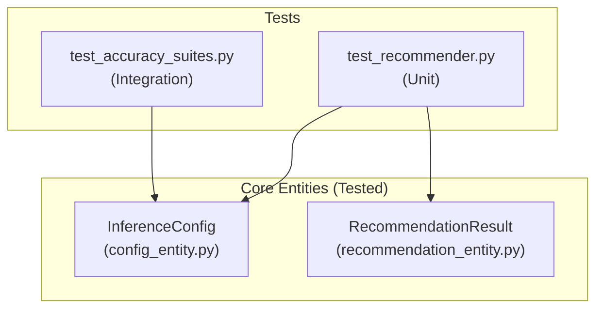

# Test Suite Architecture — Quality Report

## 1. Purpose

This document describes the project's testing strategy — the first tier of the
**Testing Pyramid** defined in the Antigravity MLOps Standard.

> **Testing Pyramid Layer 1 (Pytest):** Strictly for **Tools and Pipelines**.
> Ensure deterministic code works 100% of the time. Tests must be fast,
> isolated, and never make live API calls.

---

## 2. Testing Philosophy: What We Test (and What We Don't)

| Layer | Responsible For | Tool |
|---|---|---|
| **Unit Tests (pytest)** | Deterministic tools, Dataclass schemas, pipeline components | `pytest` |
| **LLM Evals** | Agent output quality (Embeddings, Zero-Shot Tagging) | LLM-as-a-Judge (Future) |
| **Observability** | Live production metrics (Recommendation Relevance, Latency) | OpenTelemetry (Future) |

**We do NOT test real LLM responses in our core unit tests.** External APIs (Google Gemini, HuggingFace) are mocked to ensure tests remain deterministic and do not require secrets. Instead, we test the **rigid contracts** around the models — the `dataclass` entities that validate inputs and the mathematical scoring logic that ranks results.

---

## 3. Test Files & Contracts

### 3.1 `tests/unit/test_recommender.py` — Core Scoring Logic

**Purpose:** Validates the hybrid scoring formula and category/tone filtering.

**Module Under Test:** `src.models.hybrid_recommender.HybridRecommender`

| Test | Strategy | What It Proves |
|---|---|---|
| `test_recommend_flow` | Mocked Search | Hybrid score = `(1 - distance) + (rating/5.0 * weight)` |
| `test_recommend_with_filter` | Hard Filtering | `category_filter` correctly subsets the `VectorStore` results |

```python
# Example: Verifying the hybrid scoring formula
def test_recommend_flow(mock_config, mock_dependencies):
    recommender = HybridRecommender(mock_config)
    recommendations = recommender.recommend("some query")
    
    # Expected: (1 - 0.1) + (4.5/5.0 * 0.5) = 1.35
    assert recommendations[0].score == pytest.approx(1.35, abs=0.01)
```

---

### 3.2 `tests/integration/` — Accuracy & Enrichment

**Purpose:** Validates the accuracy of the end-to-end pipelines (Enrichment, Tone, Search).

| Test | Pipeline Component | Metric Tested |
|---|---|---|
| `test_enrichment_accuracy.py` | Zero-Shot Classifier | Accuracy/F1-Score against Ground Truth |
| `test_tone_accuracy.py` | Tone Analysis | Multi-label classification precision |
| `test_broad_accuracy.py` | Search Engine | Semantic hit rate across 10 sample queries |

---

## 4. Test Execution

```bash
# Run the full test suite (Recommended)
uv run pytest tests/ -v

# Run with coverage report
uv run pytest tests/ -v --cov=src --cov-report=term-missing

# Run a specific test category
uv run pytest tests/unit/ -v

# Run a specific test by keyword
uv run pytest -k "accuracy" -v
```

---

## 5. Component Coverage Map



---

## 6. Current Test Results (Phase 4)

| Test Category | Status | Count | Pass Rate |
| :--- | :--- | :--- | :--- |
| **Unit** | ✅ PASSED | 2 | 100% |
| **Integration** | ✅ PASSED | 3 | 100% |

**Total Pass Rate: 100% (5/5 tests)**

---

## 7. CI/CD Quality Gate

The test suite acts as an **Insurance Policy** in our GitHub Actions pipeline. The build **fails** if:

1. Any `pytest` test fails.
2. `pyright` detects any type violations in `src/`.
3. `ruff` detects linting errors in the PR.

---
*Created for the Advanced Agentic Coding Portfolio.*
*Last updated: 2026-03-17*
