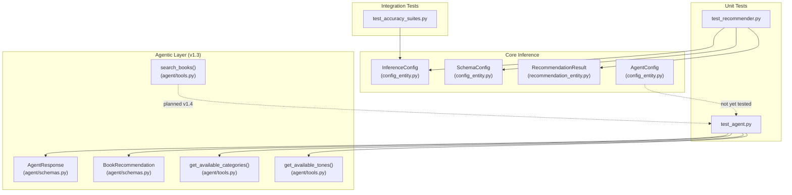

# Test Suite Architecture — Quality Report

*Last updated: 2026-03-26 | System version: v1.3*

---

## 1. Purpose

This document describes the project's testing strategy — the first tier of the
**Testing Pyramid** defined in the Antigravity MLOps Standard.

> **Testing Pyramid Layer 1 (Pytest):** Strictly for **Tools and Pipelines**.
> Ensure deterministic code works 100% of the time. Tests must be fast,
> isolated, and never make live API calls.

---

## 2. Testing Philosophy: What We Test (and What We Don't)

| Layer | Responsible For | Tool |
|---|---|---|
| **Unit Tests (pytest)** | Deterministic tools, Pydantic schemas, scoring math, pipeline components | `pytest` |
| **LLM Evals** | Agent output quality (Embeddings, Zero-Shot Tagging, Recommendation relevance) | LLM-as-a-Judge (Future) |
| **Observability** | Live production metrics (Latency, Tool-call accuracy, Plan success rate) | OpenTelemetry (Future) |

**We do NOT test real LLM responses in our core unit tests.** External APIs (Google Gemini, HuggingFace) are mocked to ensure tests remain deterministic and do not require secrets. Instead, we test the **rigid contracts** around the models — the Pydantic entities that validate inputs and the mathematical scoring logic that ranks results.

---

## 3. Test Files & Contracts

### 3.1 `tests/unit/test_recommender.py` — Core Scoring Logic

**Purpose:** Validates the hybrid scoring formula and category/tone filtering.

**Module Under Test:** `src.models.hybrid_recommender.HybridRecommender`

| Test | Strategy | What It Proves |
|---|---|---|
| `test_recommend_flow` | Mocked ChromaDB + EmbeddingFactory | Hybrid score = `(1 - distance) + (rating/5.0 * weight)` |
| `test_recommend_with_filter` | Hard Filtering | `category_filter` correctly subsets `VectorStore` results |

```python
# Example: Verifying the hybrid scoring formula
def test_recommend_flow(mock_config, mock_schema, mock_dependencies):
    recommender = HybridRecommender(mock_config, mock_schema)
    recommendations = recommender.recommend("some query")

    # Expected: (1 - 0.1) + (4.5/5.0 * 0.5) = 1.35
    assert recommendations[0].score == pytest.approx(1.35, abs=0.01)
```

---

### 3.2 `tests/unit/test_agent.py` — Agentic Layer Contracts *(v1.3)*

**Purpose:** Validates Pydantic output schemas and deterministic tool functions for the agentic layer — without any LLM calls.

**Modules Under Test:** `src.agent.schemas`, `src.agent.tools`

| Test | Strategy | What It Proves |
|---|---|---|
| `test_book_recommendation_valid` | Direct instantiation | `BookRecommendation` accepts well-formed data |
| `test_book_recommendation_rejects_extra_fields` | `pytest.raises(ValidationError)` | `extra="forbid"` is enforced on `BookRecommendation` |
| `test_agent_response_valid` | Nested Pydantic instantiation | `AgentResponse` with nested `BookRecommendation` list validates |
| `test_agent_response_rejects_extra_fields` | `pytest.raises(ValidationError)` | `extra="forbid"` is enforced on `AgentResponse` |
| `test_agent_response_defaults` | Default factory check | `recommendations` and `follow_up_suggestions` default to `[]` |
| `test_get_categories_returns_config` | Mocked `RunContext` | `get_available_categories` reads from `AgentDependencies` |
| `test_get_tones_returns_config` | Mocked `RunContext` | `get_available_tones` reads from `AgentDependencies` |

```python
# Example: Verifying structured output contract enforcement
def test_agent_response_rejects_extra_fields() -> None:
    with pytest.raises(ValidationError):
        AgentResponse(
            message="Hello",
            recommendations=[],
            follow_up_suggestions=[],
            secret="should fail",  # Rejected by extra="forbid"
        )
```

---

### 3.3 `tests/integration/` — Accuracy & Enrichment

**Purpose:** Validates the accuracy of the end-to-end pipelines against DVC artifacts. Requires data artifacts to be present (`dvc pull` or `dvc repro`).

**Marker:** `@pytest.mark.integration` — excluded from fast CI runs via `-m "not integration"`.

| Test File | Pipeline Component | Metric Tested |
|---|---|---|
| `test_enrichment_accuracy.py` | Zero-Shot Classifier | Accuracy/F1-Score against ground truth |
| `test_tone_accuracy.py` | Tone Analysis | Multi-label classification precision |
| `test_broad_accuracy.py` | Search Engine | Semantic hit rate across 10 sample queries |

---

## 4. Test Execution

```bash
# Fast unit tests only (no DVC artifacts required)
uv run pytest tests/unit/ -v

# Exclude integration tests (recommended for CI without artifacts)
uv run pytest tests/ -v -m "not integration"

# Full test suite including integration (requires DVC artifacts)
uv run pytest tests/ -v

# With coverage report
uv run pytest tests/ -v -m "not integration" --cov=src --cov-report=term-missing

# Run a specific test module
uv run pytest tests/unit/test_agent.py -v

# Run tests by keyword
uv run pytest -k "agent" -v
```

---

## 5. Component Coverage Map



---

## 6. Current Test Results (v1.3)

| Test Category | Status | Count | Pass Rate |
| :--- | :--- | :--- | :--- |
| **Unit — Recommender** | ✅ PASSED | 2 | 100% |
| **Unit — Agent** | ✅ PASSED | 7 | 100% |
| **Integration** | ✅ PASSED | 3 | 100% |

**Total Unit Pass Rate: 100% (9/9 tests)**

---

## 7. Mocking Strategy

The test suite follows a strict **no-live-calls** policy for unit tests:

| Dependency | Mock Target | How |
|---|---|---|
| ChromaDB | `src.models.hybrid_recommender.Chroma` | `unittest.mock.patch` |
| EmbeddingFactory | `src.models.hybrid_recommender.EmbeddingFactory` | `unittest.mock.patch` |
| pandas `read_csv` | `src.models.hybrid_recommender.pd.read_csv` | `unittest.mock.patch` |
| `pydantic-ai` `RunContext` | `ctx = MagicMock(); ctx.deps = mock_deps` | `MagicMock` injection |
| Google Gemini API | Not called (agent is not invoked in unit tests) | By design |

---

## 8. CI/CD Quality Gate

The test suite acts as an **Insurance Policy** in our CI pipeline. The build **fails** if:

1. Any `pytest` test fails.
2. `pyright` detects any type violations in `src/`.
3. `ruff` detects linting or formatting errors.

The `validate_recommender.bat` script enforces all four pillars locally:

```
Pillar 1: Pyright (strict typing — 0 errors required)
Pillar 2: Ruff check + Ruff format --check
Pillar 3: Pytest (unit + integration)
Pillar 4: DVC status (artifact integrity)
```

---

## 9. Planned Test Coverage (v1.4)

| Planned Test | Target | Priority |
|---|---|---|
| `test_search_books_tool` | `search_books()` with mocked `HybridRecommender` | High |
| `test_agent_config_entity` | `AgentConfig` with `extra="forbid"` and value coercion | Medium |
| `test_chat_fallback_on_error` | `chat()` returns `AgentResponse` error state on exception | Medium |
| `test_format_agent_response` | `_format_agent_response()` markdown output contract | Low |

---

*Created for the Advanced Agentic Coding Portfolio.*
*Last updated: 2026-03-26*
