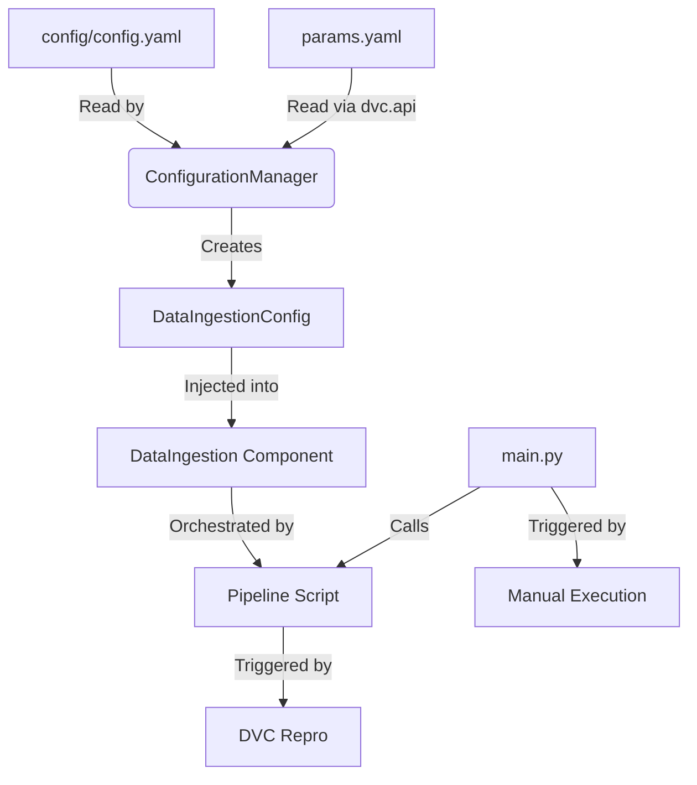

# Stage 00: Data Ingestion Architecture Report

## 1. Executive Summary
This document details the architectural design and operational logic of **Stage 00: Data Ingestion**. This stage serves as the foundation of the Hybrid Book Recommender System, establishing a reproducible, automated pipeline for acquiring and versioning the raw data.

The system is designed to move beyond simple script execution, adopting a "Platform Engineering" approach where **Configuration**, **Logic**, and **Orchestration** are strictly decoupled.

## 2. Architectural Design
The architecture follows a linear dependency injection pattern, ensuring that data flows from configuration to execution without hardcoded values.

### **The Data Flow**


### **Component Interaction**
The ingestion process is broken down into five distinct layers:

1.  **Entity Layer (`src/entity/config_entity.py`)**:
    *   **Role:** Defines the *schema* of the configuration using Python `dataclasses`.
    *   **Benefit:** Provides strict type checking. If `config.yaml` is missing a key or has the wrong type, the pipeline fails fast before execution begins.
    *   **Example:** `DataIngestionConfig` ensures that paths like `root_dir` and `source_URL` are present.

2.  **Configuration Layer (`src/config/configuration.py`)**:
    *   **Role:** The "Brain" of the operation. It reads `config.yaml` and `params.yaml`, creates necessary directories (e.g., `artifacts/data_ingestion`), and returns strict Entity objects.
    *   **Key Feature:** It utilizes **`dvc.api.params_show()`** to load parameters, ensuring that the runtime configuration is always identical to what DVC expects, guaranteeing reproducibility.

3.  **Component Layer (`src/components/data_ingestion.py`)**:
    *   **Role:** The "Worker." It contains the pure functional logic (downloading files, extracting Zips).
    *   **Isolation:** It knows *nothing* about file paths or DVC. It simply receives a `DataIngestionConfig` object and executes the tasks defined in it.

4.  **Pipeline Layer (`src/pipeline/stage_01_ingestion.py`)**:
    *   **Role:** The "Conductor." It instantiates the Configuration Manager, retrieves the Config Entity, initializes the Component, and triggers the methods.

5.  **Entry Point (`main.py`)**:
    *   **Role:** The top-level orchestrator. It provides a clean entry point for the entire system, wrapping the execution in logging and exception handling. It allows developers to run the pipeline from the root directory easily.
    *   **Implementation:**

    ```python
    """
    This module acts as the entry point for the hybrid book recommender system.
    It orchestrates the project's pipeline.
    """

    from src.utils.logger import get_logger
    from src.pipeline.stage_01_ingestion import DataIngestionTrainingPipeline

    STAGE_NAME = "Data Ingestion Stage"
    logger = get_logger(__name__)

    try:
        logger.info(f">>>>>> Stage {STAGE_NAME} started <<<<<<")
        data_ingestion = DataIngestionTrainingPipeline()
        data_ingestion.main()
        logger.info(f">>>>>> Stage {STAGE_NAME} completed <<<<<<\n")
    except Exception as e:
        logger.exception(e)
        raise e
    ```

## 3. DVC and Configuration Setup

### **DVC-Centric Configuration**
A critical design choice in this project is the **DVC-Centric** approach to parameter management.

*   **`dvc.yaml`**: Acts as the Makefile for the MLOps pipeline. It defines:
    *   **Command:** `uv run python -m src.pipeline.stage_01_ingestion`
    *   **Dependencies (`deps`):** The source code (`src/pipeline/stage_01_ingestion.py`) and config (`config/config.yaml`).
    *   **Outputs (`outs`):** The downloaded data folder (`artifacts/data_ingestion`).
*   **The Logic:** When `dvc repro` is run:
    1.  DVC checks the content hash (md5) of the dependencies.
    2.  If the config or code has changed, it re-runs the stage.
    3.  If nothing has changed, it skips the stage, saving time and computation.

### **Params.yaml & dvc.api**
By loading parameters via `dvc.api.params_show()` in `src/config/configuration.py`, we bridge the gap between code and orchestration. This ensures that:
*   We can track experiments using DVC's experiment tracking features.
*   The code explicitly depends on the *versioned* state of parameters, preventing "magic number" bugs where local variables differ from tracked configurations.

## 4. Why This is "Robust MLOps"

This workflow solves several common failures in ad-hoc Data Science scripts:

1.  **Reproducibility (The "It works on my machine" fix):**
    *   By explicitly tracking the **Input** (`config.yaml`), **Logic** (Git hash), and **Output** (`dvc.lock`), any developer can clone the repo, run `dvc repro`, and get the *exact same* dataset.

2.  **Maintainability (Separation of Concerns):**
    *   If the URL changes, we update `config.yaml` (no code change).
    *   If we need to switch from Zip to Tar, we update `data_ingestion.py` (no config change).
    *   This decoupling reduces regression risks during refactoring.

3.  **Traceability:**
    *   The `artifacts/` directory structure provides a clear lineage. We can verify exactly when data was downloaded and what version of the code was used to download it.

4.  **Error Handling:**
    *   The use of `src/utils/exception.py` and `logger` ensures that if a download fails (e.g., network error), the pipeline stops gracefully with a clear audit log, rather than crashing silently or leaving corrupted data.
