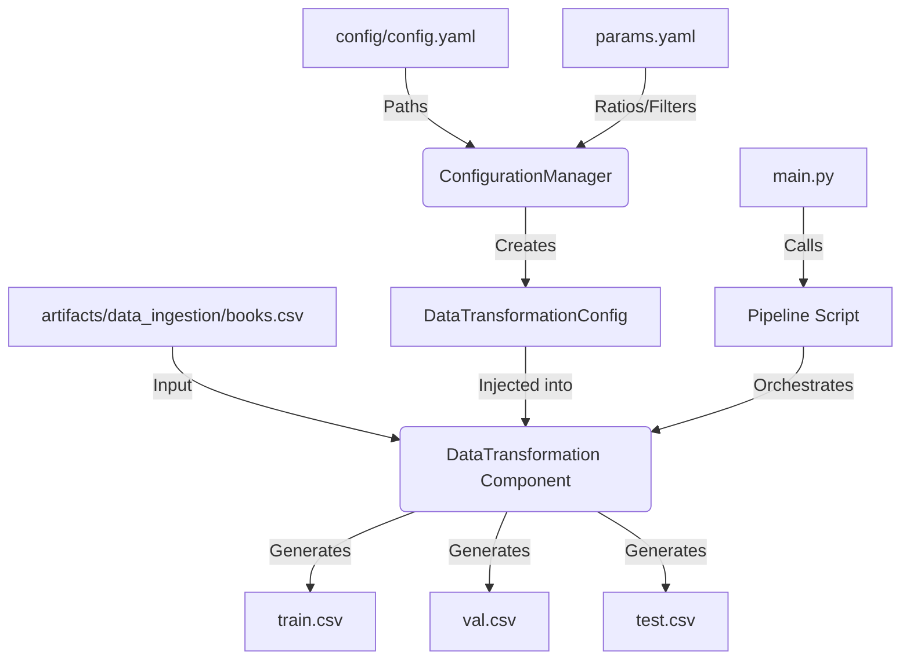

# Stage 01: Data Transformation Architecture Report

## 1. Executive Summary
This document details the architectural design and operational logic of **Stage 01: Data Transformation**. This stage is responsible for converting raw, ingested data into production-ready datasets (Train, Validation, and Test sets) through rigorous cleaning and deterministic splitting.

The transformation process adheres to MLOps best practices by ensuring that every cleaning step and split ratio is externally configurable, version-controlled via DVC, and fully reproducible across any environment.

## 2. Architectural Design
The transformation stage follows the same decoupled architecture as the ingestion stage, separating configuration from execution.

### **The Data Flow**


### **Component Interaction**
The transformation process is structured across five layers:

1.  **Entity Layer (`src/entity/config_entity.py`)**:
    *   **Role:** Defines the `DataTransformationConfig` schema.
    *   **Attributes:** Includes `root_dir`, `data_path`, `test_size`, `val_size`, `random_state`, and `min_desc_len`.
    *   **Benefit:** Ensures the component receives valid, typed parameters for the splitting and cleaning logic.

2.  **Configuration Layer (`src/config/configuration.py`)**:
    *   **Role:** Merges static paths from `config.yaml` with dynamic parameters from `params.yaml`.
    *   **Key Feature:** It fetches specific filters (e.g., `min_desc_len`) and split ratios from `params.yaml`, allowing for experimental tuning without code modifications.

3.  **Component Layer (`src/components/data_transformation.py`)**:
    *   **Role:** The "Processor." Implements two primary functions:
        *   **`clean_data`**: Handles domain-specific cleaning (sanitizing text, filtering short descriptions, removing duplicates).
        *   **`initiate_data_transformation`**: Performs the 3-way deterministic split using Scikit-Learn.
    *   **Isolation:** The logic is independent of the orchestration tool (DVC/GitHub Actions).

4.  **Pipeline Layer (`src/pipeline/stage_02_transformation.py`)**:
    *   **Role:** The "Conductor." Manages the sequence: Init Config -> Init Component -> Execute Transformation.
    *   **Implementation:**
    ```python
    config = ConfigurationManager()
    data_transformation_config = config.get_data_transformation_config()
    data_transformation = DataTransformation(config=data_transformation_config)
    data_transformation.initiate_data_transformation()
    ```

5.  **Entry Point (`main.py`)**:
    *   **Role:** Provides the unified interface. It wraps the transformation stage in professional logging and exception handling.

## 3. Transformation Strategy & DVC Setup

### **Data Cleaning Logic**
The system performs high-precision cleaning to ensure model quality:
*   **Description Filtering:** Records with missing or excessively short descriptions (defined by `min_desc_len`) are pruned.
*   **Text Sanitation:** Regex-based cleaning of `categories` and `authors` to remove JSON-like bracket notation.
*   **Deduplication:** Strict duplicate removal based on `isbn13` to prevent data leakage between splits.

### **3-Way Deterministic Split**
To support modern MLOps validation, we implement a three-way split:
1.  **Train Set:** Primary data for model optimization.
2.  **Validation Set:** For hyperparameter tuning and early stopping.
3.  **Test Set:** Final unbiased evaluation.

The split is made deterministic by injecting a `random_seed` from `params.yaml`.

### **DVC Orchestration (`dvc.yaml`)**
The transformation stage is tightly integrated into the DVC DAG:
*   **Dependencies:** Listens for changes in the raw data (`books.csv`), the pipeline script, and the configuration.
*   **Params Tracking:** DVC explicitly tracks `test_size`, `val_size`, and `min_desc_len`. If any of these values change in `params.yaml`, DVC will mark this stage as "out of date" and re-run it.
*   **Outputs:** Version-controls the three CSV artifacts in `artifacts/data_transformation`.

## 4. Why This is "Robust MLOps"

1.  **Deterministic Lineage:**
    By controlling the `random_state` via configuration, we ensure that every developer and CI/CD runner sees the exact same training and test sets, which is crucial for debugging model performance.

2.  **Experiment Agility:**
    Scientists can adjust the `min_desc_len` or `test_size` in `params.yaml` and run `dvc repro`. The system automatically re-cleans and re-splits the data without a single line of Python being changed.

3.  **Data Quality Guardrails:**
    The transformation component includes logging for data shapes at every step. This provides an audit trail: if the dataset size drops unexpectedly, the logs immediately reveal which step (cleaning or splitting) was responsible.

4.  **Resource Efficiency:**
    Using DVC's caching and dependency tracking, the transformation stage only runs if something actually changed. If we only update the training script (Stage 03), DVC skips the transformation and reuses the existing `train.csv`.
