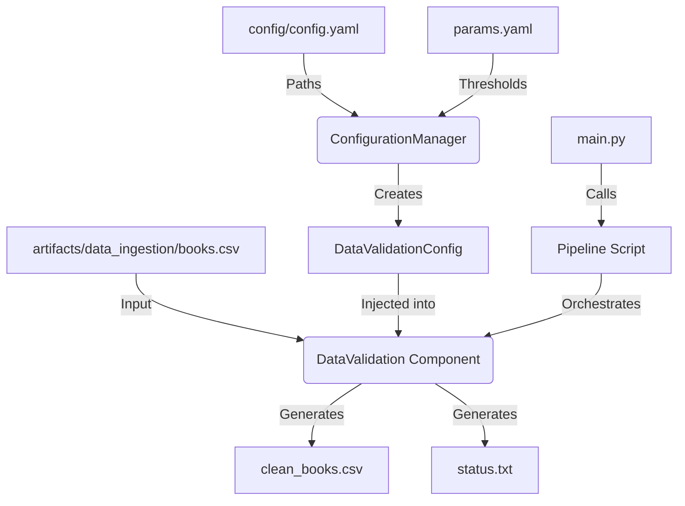

# Stage 01: Data Validation Architecture Report

## 1. Executive Summary
This document details the architectural design and operational logic of **Stage 01: Data Validation**. This stage serves as the "Quality Gate" of the Hybrid Book Recommender project, ensuring that only high-quality, sanitized data proceeds to the transformation and training stages.

It handles rigorous data cleaning, schema enforcement, and sanity checks, producing a `clean_books.csv` artifact that acts as the single source of truth for downstream components.

## 2. Architectural Design
The validation stage is decoupled from ingestion and transformation, allowing for independent evolution of cleaning logic without affecting data acquisition or splitting strategies.

### **The Data Flow**


### **Component Interaction**
The validation process is structured across five layers:

1.  **Entity Layer (`src/entity/config_entity.py`)**:
    *   **Role:** Defines the `DataValidationConfig` schema.
    *   **Attributes:** Includes `root_dir`, `unzip_data_dir`, `STATUS_FILE`, `cleaned_data_file`, `min_desc_len`, and `categories_min_len`.
    *   **Benefit:** Provides strict type checking and centralized parameter management for the cleaning logic.

2.  **Configuration Layer (`src/config/configuration.py`)**:
    *   **Role:** Resolves paths and parameters needed for validation.
    *   **Key Feature:** It fetches specific cleaning thresholds (e.g., `min_desc_len`, `categories_min_len`) from `params.yaml`, allowing for rapid data policy updates.

3.  **Component Layer (`src/components/data_validation.py`)**:
    *   **Role:** The "Gatekeeper." Implements the `validate_and_clean_data` method which executes:
        *   **Missing Value Handling**: Drops rows missing critical search/embedding fields (Title, Description).
        *   **Length Filtering**: Removes "stub" descriptions that wouldn't provide enough information for a recommender.
        *   **Text Sanitation**: Cleans list-like artifacts (e.g., `['Fiction']` -> `Fiction`) using regex.
        *   **Deduplication**: Ensures ISBN13 uniqueness to prevent duplicate recommendations.
        *   **Status Reporting**: Writes a validation status file used for pipeline health checks.

4.  **Pipeline Layer (`src/pipeline/stage_02_validation.py`)**:
    *   **Role:** The "Conductor." Manages the execution flow and captures the validation state.
    ```python
    config = ConfigurationManager()
    data_validation_config = config.get_data_validation_config()
    data_validation = DataValidation(config=data_validation_config)
    data_validation.validate_and_clean_data()
    ```

5.  **Entry Point (`main.py`)**:
    *   **Role:** Unified interface with logging and exception handling.

## 3. Validation Strategy & DVC Setup

### **Data Cleaning Logic**
The validation component implements specific domain rules for the book dataset:
*   **Cleaning Regex**: `[\[\]']` is removed from `categories` and `authors` to ensure the data is stored in a clean, human-readable format rather than Python list strings.
*   **Threshold-based Filtering**: We use `min_desc_len` and `categories_min_len` from `params.yaml` to filter out low-quality entries.

### **Pipeline Integrity**
A `status.txt` file is generated to track the success of the validation. If the cleaning process results in an empty dataset, the pipeline fails early, preventing wasted compute in the training stages.

### **DVC Orchestration (`dvc.yaml`)**
*   **Dependencies:** Listens for changes in the raw ingested data and the validation code.
*   **Params Tracking:** DVC tracks `data_validation.min_desc_len` and `data_validation.categories_min_len`. Any change here triggers a re-validation and re-transformation.
*   **Outputs:** Version-controls `artifacts/data_validation/clean_books.csv`.

## 4. Why This is "Robust MLOps"

1.  **Fail-Fast Mechanism**:
    By validating data immediately after ingestion, we prevent corrupted or poor-quality data from propagating into embeddings or model training.

2.  **Centralized Cleaning Policy**:
    Instead of scattering cleaning logic across notebooks or multiple scripts, all data quality rules are consolidated in one component and one parameter file.

3.  **Auditability**:
    The `status.txt` file and logging provide a clear audit trail of how many rows were dropped and for what reason.

4.  **Decoupled Splitting**:
    By separating cleaning (Validation) from splitting (Transformation), we can experiment with different train/test ratios without having to re-run the cleaning logic, saving time on large datasets.
