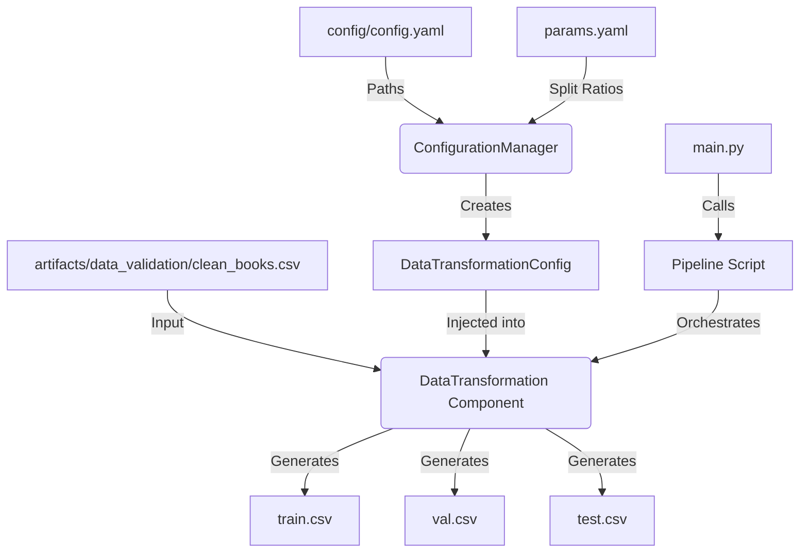

# Stage 02: Data Transformation Architecture Report

## 1. Executive Summary
This document details the architectural design and operational logic of **Stage 02: Data Transformation**. This stage is responsible for converting the cleaned dataset into production-ready subsets (Train, Validation, and Test sets) through deterministic splitting.

Following the project's modular design, the transformation stage is now strictly focused on **Data Partitioning**, having delegated cleaning responsibilities to the upstream Validation stage.

## 2. Architectural Design
The transformation stage follows a linear dependency injection pattern, consuming the output of Stage 01 (Validation).

### **The Data Flow**


### **Component Interaction**
The transformation process is structured across five layers:

1.  **Entity Layer (`src/entity/config_entity.py`)**:
    *   **Role:** Defines the `DataTransformationConfig` schema.
    *   **Attributes:** Includes `root_dir`, `data_path`, `test_size`, `val_size`, and `random_state`.
    *   **Benefit:** Ensures the component receives valid, typed parameters specifically for splitting logic.

2.  **Configuration Layer (`src/config/configuration.py`)**:
    *   **Role:** Resolves split ratios and paths.
    *   **Key Feature:** Fetches `test_size` and `val_size` from `params.yaml`, allowing for experimental tuning of dataset sizes without code changes.

3.  **Component Layer (`src/components/data_transformation.py`)**:
    *   **Role:** The "Splitter." Implements the `initiate_data_transformation` method.
    *   **Main Task**: Performs a 3-way deterministic split using `sklearn.model_selection.train_test_split`.
    *   **Simplification**: This component no longer performs data cleaning, as it assumes the input `clean_books.csv` is already sanitized.

4.  **Pipeline Layer (`src/pipeline/stage_03_transformation.py`)**:
    *   **Role:** The "Conductor." Manages the sequence: Init Config -> Init Component -> Execute Partitioning.
    ```python
    config = ConfigurationManager()
    data_transformation_config = config.get_data_transformation_config()
    data_transformation = DataTransformation(config=data_transformation_config)
    data_transformation.initiate_data_transformation()
    ```

5.  **Entry Point (`main.py`)**:
    *   **Role:** Top-level orchestrator with professional logging.

## 3. Partitioning Strategy & DVC Setup

### **3-Way Deterministic Split**
To ensure reproducible experiments, the dataset is split using a configured `random_state`:
1.  **Train Set**: Used for model training.
2.  **Validation Set**: Used for hyperparameter tuning.
3.  **Test Set**: Reserved for final performance evaluation.

The ratios are managed in `params.yaml`, enabling scientists to quickly shift between different experimental setups (e.g., 80/10/10 vs 70/15/15).

### **DVC Orchestration (`dvc.yaml`)**
*   **Dependencies**: The transformation stage depends on the *output* of the validation stage (`clean_books.csv`).
*   **Params Tracking**: Tracks `test_size`, `val_size`, and `random_state`.
*   **Outputs**: Version-controls the resulting `train.csv`, `val.csv`, and `test.csv` in `artifacts/data_transformation`.

## 4. Why This is "Robust MLOps"

1.  **Separation of Concerns**:
    By removing cleaning logic from Transformation, the code is easier to maintain. If cleaning rules change, only the Validation stage is affected. If the split ratio changes, only the Transformation stage re-runs.

2.  **Deterministic Data Lineage**:
    The use of a fixed `random_state` ensures that the "Train" set today is exactly the same as the "Train" set tomorrow, even if run on a different machine.

3.  **Computation Efficiency**:
    DVC correctly identifies that if the raw data hasn't changed but a split ratio has, it only needs to re-run the splitting (Transformation) and not the expensive cleaning (Validation).

4.  **Artifact Traceability**:
    Each split is saved as a distinct CSV file with logged shapes, providing a clear audit trail of the data used for every training run.
