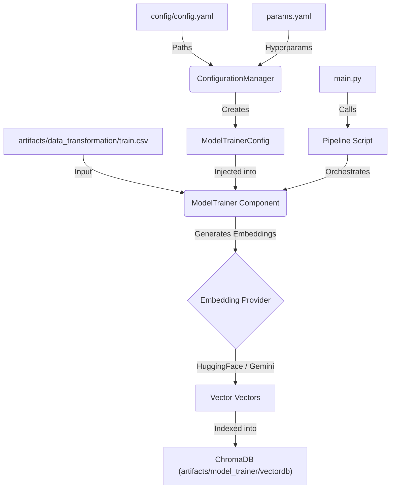

# Stage 03: Model Training Architecture Report

## 1. Executive Summary
This document details the architectural design and operational logic of **Stage 03: Model Training**. In the context of this Hybrid Recommender System, "Training" refers to the construction of the **Vector Database (Semantic Index)**.

This stage ingests the processed training data, generates high-dimensional vector embeddings using state-of-the-art Large Language Models (LLMs), and persists them into a ChromaDB vector store. It is designed to be **provider-agnostic**, allowing seamless switching between local HuggingFace models and cloud-based Gemini APIs via simple configuration changes.

## 2. Architectural Design
The training architecture isolates the embedding generation logic from the storage mechanism, ensuring that the vector database can be rebuilt or swapped without affecting the upstream data processing.

### **The Data Flow**


### **Component Interaction**
The semantic indexing process is structured across five layers:

1.  **Entity Layer (`src/entity/config_entity.py`)**:
    *   **Role:** Defines the `ModelTrainerConfig` schema.
    *   **Attributes:** `root_dir`, `data_path` (train.csv), `db_path`, `embedding_provider`, `model_name`, `collection_name`, and `batch_size`.

2.  **Configuration Layer (`src/config/configuration.py`)**:
    *   **Role:** Centralizes the retrieval of API keys and model parameters.
    *   **Key Feature:** it reads `embedding_provider` (e.g., 'huggingface' or 'gemini') from `params.yaml`, enabling the user to switch between offline and online inference modes instantly.

3.  **Component Layer (`src/components/model_trainer.py`)**:
    *   **Role:** The "Engine."
    *   **Responsibilities:**
        *   **Context Preparation:** Combines Title, Author, Description, and Category into a single "Context String" for embedding.
        *   **Metadata Enrichment:** Attaches ISBN, Title, and Authors to the vector payload so they can be retrieved during search without a secondary valid lookup.
        *   **Vector Store Management:** Handles the initialization and *resetting* of the ChromaDB collection to ensure no stale data remains from previous runs.

4.  **Pipeline Layer (`src/pipeline/stage_04_training.py`)**:
    *   **Role:** The "Conductor."
    ```python
    config = ConfigurationManager()
    model_trainer_config = config.get_model_trainer_config()
    model_trainer = ModelTrainer(config=model_trainer_config)
    model_trainer.initiate_model_training()
    ```

5.  **Entry Point (`main.py`)**:
    *   **Role:** Unifies the execution triggers.

## 3. Training Strategy & DVC Setup

### **Hybrid Embedding Strategy**
The system supports two modes of operation, controlled via `params.yaml`:
1.  **Local Mode (HuggingFace)**: Uses `sentence-transformers/all-MiniLM-L6-v2`. fast, free, and runs entirely on CPU/GPU. Ideal for development and CI/CD.
2.  **Cloud Mode (Gemini)**: Uses `models/embedding-001`. Provides superior semantic understanding for complex queries but requires an API key.

### **Metadata-First Indexing**
Unlike simple vector stores that only save IDs, we embed rich metadata directly into the ChromaDB documents.
*   **Content:** `Title + Author + Description + Category` (Used for similarity search).
*   **Metadata:** `ISBN, Title, Author, Category` (Returned immediately to the user).

This "Metadata-First" approach eliminates the need for a secondary generic database lookup during inference, reducing latency.

### **DVC Orchestration (`dvc.yaml`)**
*   **Dependencies:** The training stage depends on the `train.csv` artifact from the Transformation stage.
*   **Params Tracking:** DVC tracks `model_name`, `collection_name`, and `batch_size`. Changing the model name triggers a full re-indexing.
*   **Outputs:** Version-controls the `artifacts/model_trainer/vectordb` directory. This allows us to simplified "rollback" to a previous version of the vector database if a new model performs poorly.

## 4. Why This is "Robust MLOps"

1.  **Provider Agnosticism:**
    The codebase uses the `Factory Pattern` (`get_embedding_function`) to instantiate embeddings. Adding a new provider (e.g., OpenAI or Cohere) only requires updating one method, not the entire pipeline.

2.  **Idempotency:**
    The trainer explicitly removes the existing vector database directory before running (`shutil.rmtree`). This ensures the resulting index is a pure function of the input data, preventing "ghost records" from deleted books.

3.  **Resource Management:**
    Indexing is performed in configurable batches (`batch_size` in `params.yaml`). This prevents OOM (Out Of Memory) errors when processing large datasets or using memory-intensive local models.

4.  **Security:**
    API keys are loaded via `dotenv` and never hardcoded, compliant with security best practices.
