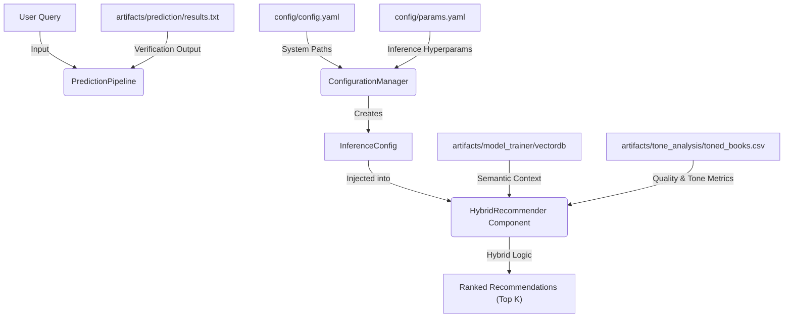

# Stage 05: Hybrid Inference Architecture Report

## 1. Executive Summary
This document details the architectural design and operational logic of **Stage 05: Hybrid Inference Engine**. This is the decision-making "Brain" of the system, responsible for converting natural language user queries into prioritized book recommendations.

The Hybrid Inference Engine moves beyond simple semantic retrieval by incorporating a **Quality Control Layer**. It combines high-dimensional vector similarity (semantic match) with analytical metadata (average ratings and popularity) to ensure that recommendations are not only relevant to the topic but also of high quality for the end-user.

## 2. Architectural Design
The inference architecture is designed for low-latency retrieval and strict decoupling from the training lifecycle, allowing for independent scaling and configuration.

### **The Inference Flow**


### **Component Interaction**
The inference process is organized into five specialized layers:

1.  **Entity Layer (`src/entity/config_entity.py`)**:
    *   **Role:** Defines the `InferenceConfig` schema.
    *   **Attributes:** `model_name`, `embedding_provider`, `chroma_db_dir`, `data_path` (toned_books.csv), `collection_name`, `top_k`, and `popularity_weight`.

2.  **Configuration Layer (`src/config/configuration.py`)**:
    *   **Role:** Orchestrates the injection of parameters and immutable system paths.
    *   **Key Feature:** Uses `dvc.api.params_show()` to ensure that inference runs are reproducible and reflect the latest tracked hyperparameters.

3.  **Component Layer (`src/models/hybrid_recommender.py`)**:
    *   **Role:** The "Decision Engine."
    *   **Responsibilities:**
        *   **Vector Querying:** Uses `EmbeddingFactory` to convert queries into vectors and performs a similarity search against ChromaDB.
        *   **Metadata Lookup:** Performs O(1) lookups in the metadata store (Pandas indexed by ISBN) to retrieve quality metrics AND **Emotion Probabilities**.
        *   **Dynamic Scoring:** context-aware switch between **Weighted Hybrid Score** and **Tone Probability Sort**.

4.  **Utility Layer (`src/models/llm_utils.py`)**:
    *   **Role:** Hardware/API Abstraction.
    *   **Responsibilities:** Ensures the same embedding logic is used in both Training and Inference via the `EmbeddingFactory`.

5.  **Pipeline Layer (`src/pipeline/stage_05_prediction.py`)**:
    *   **Role:** The "Orchestrator."
    ```python
    config_manager = ConfigurationManager()
    inference_config = config_manager.get_inference_config()
    recommender = HybridRecommender(config=inference_config)
    results = recommender.recommend(query)
    ```

## 3. Inference Strategy & Hybrid Logic

### **The Context-Aware Ranking Strategy**
The system uses a dynamic mechanism to rank candidates based on user intent:

#### **A. General Search (Default)**
$$ Score_{final} = (1 - Distance_{cosine}) + \alpha \cdot (\frac{Rating_{avg}}{5.0}) $$
*   **Significance:** Prevents the "Niche Trap" (recommending a 1-star book) and the "Bestseller Bias" (recommending popular but irrelevant books).

#### **B. Outcome-Based Search (Tone Active)**
$$ Rank = SortDown(P_{emotion}) $$
*   **Logic:** If a user selects "Joy", we filter semantically relevant books and then sort them by their `joy` probability score (calculated in `stage_04`).
*   **Significance:** Ensures that when a user wants a specific "vibe", the system delivers the most emotionally potent match, even if it's slightly less semantically perfect.

### **Decoupled Architecture**
Unlike traditional systems where inference is a subset of training code, our architecture allows:
*   **Configurable Flavor:** Changing the `popularity_weight` instantly changes the "personality" of the recommender (from strictly relevant to generally popular).
*   **Model Independence:** Inference can use a different execution provider (e.g., a fast Cloud API) than the one used for heavy-duty batch indexing (e.g., local GPU).

### **DVC Orchestration (`dvc.yaml`)**
The inference engine is integrated as a full pipeline stage:
*   **Dependencies:** Tracking `vectordb` and `clean_books.csv`.
*   **Parameter Sensitivity:** Any change to `top_k` or `popularity_weight` triggers a re-run of the prediction stage.
*   **Artifacts:** Results are saved to `artifacts/prediction/results.txt`, enabling "Smoke Testing" of the model's performance during every `dvc repro`.

## 4. Why This is "Robust MLOps"

1.  **Resilient Data Casting:**
    The engine includes robust logic to handle ISBN cleaning and Int64/String casting, ensuring that the link between the VectorDB and the Metadata Store never breaks due to formatting inconsistencies.

2.  **Memory-Efficient Lookups:**
    Instead of performing slow SQL joins or API calls for every candidate, the system loads the metadata into an in-memory optimized index (Pandas set_index), allowing for sub-millisecond scoring.

3.  **Strict Type Enforcement:**
    Using Pydantic/Dataclass entities for configuration prevents "AttributeErrors" common in loosely typed inference scripts.

4.  **Pipeline Integrity:**
    By including inference in the DVC DAG, we ensure that the system is **End-to-End Verifiable**. We don't just "train" a model; we scientifically verify its "suitability" for inference before deployment.
