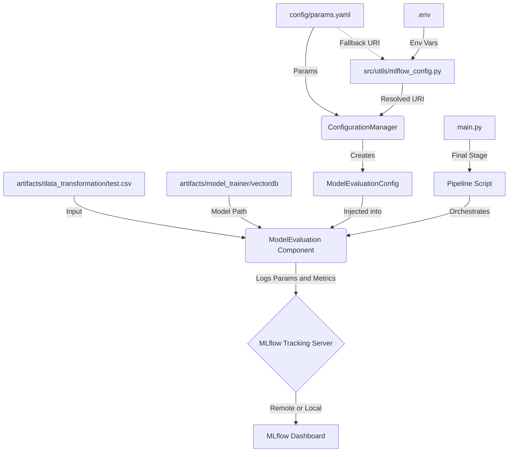

# Stage 06: Model Evaluation & MLflow Tracking Report

## 1. Executive Summary
This document details the architecture and implementation of **Stage 06: Model Evaluation**, which serves as the "Audit & Governance" layer of the Hybrid Recommender System. 

By integrating **MLflow**, the system transitions from a "black-box" training script to a transparent, production-grade experiment tracking platform. Every run captures the exact configuration (parameters), success metrics, and environmental metadata, ensuring 100% reproducibility and accountability for model performance changes.

## 2. Architectural Design
The evaluation architecture is designed to capture the "State of the System" at the end of the pipeline execution.

### **The Data Flow**


### **Component Interaction**
The tracking process is structured across three primary layers:

1.  **Entity Layer (`src/entity/config_entity.py`)**:
    *   **Role:** Defines the `ModelEvaluationConfig`.
    *   **Attributes:** `root_dir`, `data_path`, `model_path`, `all_params` (The entire params tree), and `mlflow_uri`.

2.  **Configuration Layer (`src/config/configuration.py`)**:
    *   **Role:** Extracts MLflow-specific settings and bundles the global `params.yaml` into the config entity.
    *   **Key Feature:** it ensures that the `experiment_name` is consistently applied across all runs within a project scope.

3.  **Component Layer (`src/components/model_evaluation.py`)**:
    *   **Role:** The "Reporter."
    *   **Responsibilities:**
        *   **Dynamic Run Naming:** Generates run names following the pattern `{provider}_{model_name}_{timestamp}` (e.g., `huggingface_all-MiniLM-L6-v2_2026-01-29_00-27-01`).
        *   **Parameter Flattening:** Iterates through the entire configuration tree and logs every hyperparameter used in the pipeline (from validation thresholds to embedding providers).
        *   **Metric Logging:** Calculates and logs evaluation metrics (currently tracking dataset size, extensible to similarity scores and hit rates).

## 3. MLOps Tracking Strategy

### **Dynamic Experimentation**
The system treats the **Embedding Model** and **Provider** as the primary independent variables. By naming runs dynamically based on these variables, the MLflow dashboard becomes an instantly readable leaderboard of different architectures.

### **Unified Configuration Capture**
Unlike traditional logging which only tracks model hyperparameters, our implementation logs the **entire pipeline state**. If a user changes a preprocessing threshold in `stage_02`, that change is automatically captured in the MLflow run for `stage_06`. 

### **DVC Integration (`dvc.yaml`)**
*   **Linage:** The evaluation stage depends on the `test.csv` (Transformation) and `vectordb` (Trainer) artifacts.
*   **Metrics Tracking:** The stage outputs `artifacts/model_evaluation/metrics.json`, which is registered as a DVC metric. This allows for command-line comparisons:
    ```bash
    dvc metrics show
    ```

## 4. Environment Strategy & Configuration

The system implements a production-grade "Priority Logic" for MLflow tracking, ensuring that development runs do not pollute the production experiment history.

### **Priority Logic**
The `src/utils/mlflow_config.py` utility determines the tracking URI based on the following precedence:
1.  **Environment Variable** (`MLFLOW_TRACKING_URI` in `.env`) → **Highest Priority** (Used for Local Development & Docker)
2.  **Staging Defaults** → Use for staging environments.
3.  **`params.yaml`** → **Fallback** (Used manually or when env vars are missing).

### **Local vs. Remote (DagsHub)**

| Feature | **Local Server (127.0.0.1:5000)** | **Remote (DagsHub)** |
| :--- | :--- | :--- |
| **Visibility** | **Private:** Only visible on the host machine. | **Public/Team:** Visible to the entire team. |
| **Storage** | **Ephemeral:** Data lost if `./mlruns` is deleted. | **Persistent:** Stored securely in the cloud. |
| **Use Case** | Debugging, rapid prototyping, breaking changes. | Final model Training, Portfolio showcase, Team sharing. |

### **Implementation Strategy**
*   **For Development:** Keep `MLFLOW_TRACKING_URI=http://127.0.0.1:5000` active in `.env`. This prevents you from "spamming" the official DagsHub project with broken or experimental runs while you are coding.
*   **For Production/Showcase:** When you are ready to produce a "Final Model" to show the team, simply comment out the line in `.env` to fallback to the DagsHub URI defined in `params.yaml`.

## 5. Why This is "Robust MLOps"

1.  **Centralized Visibility:**
    Stakeholders can view the results of every experiment via a web UI (Local or DagsHub), eliminating the need to parse raw log files or manually record results in spreadsheets.

2.  **Automated Accountability:**
    The use of timestamps and model names in run titles ensures that no two experiments are confused, even if run in rapid succession.

3.  **Governance & Audit:**
    Logging the `all_params` dictionary creates an immutable record of the system configuration. This is critical for "Model Lineage"—knowing exactly how a specific set of recommendations was generated three months after the fact.

4.  **Extensibility:**
    The `ModelEvaluation` component is built to be "Metric-Agnostic." As more complex evaluation metrics (e.g., NDCG, MRR, or Silhouette scores) are developed, they can be added to the metrics dictionary and will be automatically tracked without changing the core architectural flow.

## 6. How to View Experiments

To launch the MLflow User Interface and explore the tracked parameters and metrics, run the following command from the project root:

```powershell
uv run mlflow ui
```

By default, the UI will be accessible at: `http://127.0.0.1:5000`
