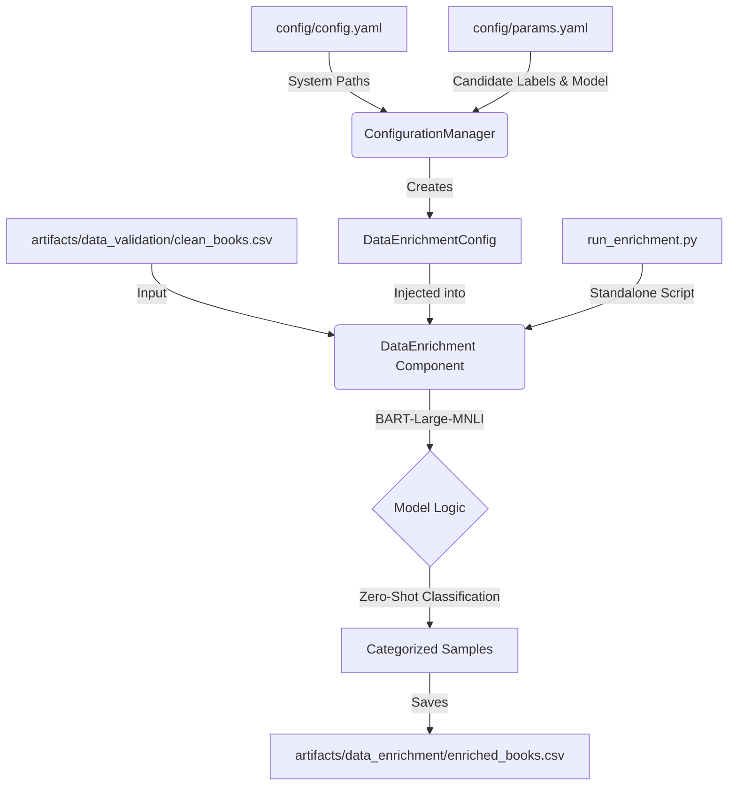

# Stage 3.5: Data Enrichment Architecture Report

## 1. Executive Summary
This document details the architectural design and operational logic of **Stage 3.5: Data Enrichment (Zero-Shot Classification)**. This stage addresses the "Semantic Drift" and "Metadata Variety" problems by using Natural Language Inference (NLI) to map inconsistent web-scraped categories into a few standardized, high-utility facets.

Instead of relying on often obscure or missing category information, this stage uses a Large Language Model (BART) to "read" book descriptions and categorize them into a user-defined set of buckets (e.g., Fiction, Tech, Science). This enables the recommendation engine to offer categorical "facets" in the UI, significantly improving the user's ability to filter results beyond raw semantic similarity.

## 2. Architectural Design
The enrichment stage is designed as an **Offline Batch Process**. Due to the high computational intensity of transformer-based classification, this step is decoupled from the main DVC pipeline to ensure fast development cycles while maintaining data lineage.

### **The Enrichment Flow**

### **Component Interaction**
The enrichment process is built with strict modularity:

1.  **Entity Layer (`src/entity/config_entity.py`)**:
    *   **Role:** Defines the `DataEnrichmentConfig`.
    *   **Attributes:** `root_dir`, `data_path`, `enriched_data_path`, `model_name`, `candidate_labels`, and `batch_size`.

2.  **Configuration Layer (`src/config/configuration.py`)**:
    *   **Role:** Resolves paths and hyper-parameters. 
    *   **Fallback Logic:** The `ConfigurationManager` includes logic to preferentially point the Inference stage to the `enriched_books.csv` if it exists, otherwise falling back to `clean_books.csv`.

3.  **Component Layer (`src/components/data_enrichment.py`)**:
    *   **Role:** The "Classifier Engine."
    *   **Responsibilities:**
        *   **Dynamic Labeling**: Performs classification using `candidate_labels` from `params.yaml` (Zero-shot).
        *   **Resource Management**: Implements batch processing for memory efficiency and automatically detects NVIDIA GPUs via `torch.cuda`.
        *   **Metadata Expansion**: Appends a new `simple_category` column to the existing dataset.

4.  **Script Layer (`src/scripts/run_enrichment.py`)**:
    *   **Role:** Entry point for the offline run.

## 3. Classification Strategy

### **Zero-Shot Inference (BART-Large-MNLI)**
Unlike traditional classifiers that require training data for every category, we use an **NLI-based Zero-Shot model**. The model treats the description as the *premise* and each candidate label as a *hypothesis* (e.g., "This text is about Fiction").
*   **Benefits**: No manual labeling required; labels can be changed in `params.yaml` without re-training.
*   **Labels**: Standardized into `["Fiction", "Non-Fiction", "Science", "History", "Biography", "Fantasy", "Thriller"]`.

### **Weighted Performance Balancing**
To avoid bottlenecking the pipeline:
*   **Batch Size**: Configurable in `params.yaml` (default: 16) to optimize CPU/GPU utilization.
*   **CPU Optimization**: Uses `torch` optimized for the local environment.

## 4. Why This is "Robust MLOps"

1.  **Contextual Fallback Logic**:
    The system is "Enrichment-Aware." The `ConfigurationManager` intelligently checks for the existence of enriched artifacts. This ensures the recommendation pipeline never breaks, even if the user chooses not to run the expensive enrichment stage.

2.  **Faceting vs. Categorization**:
    By condensing 500+ messy categories into 7 broad facets, we convert "Noise" into "Actionable UI elements." This is a key transition from **Data Science** (finding metadata) to **Product Engineering** (making metadata useful).

3.  **Hardware Inversion**:
    The code detects the computing environment. Whether running on a developer's GPU laptop or a production CPU server, the pipeline adjusts its `device` parameter automatically, ensuring cross-environment compatibility.

4.  **Metadata Integrity**:
    The enrichment process preserves all original columns while adding the new facet. This maintains full backwards compatibility with existing indexing and validation stages.

## 5. Test Run

### Test Run Success 🚀

I processed a sample of 20 books using the BART-Large-MNLI model. The Zero-Shot classification correctly mapped messy categories into our clean facets:

|Title	|Original Category	|Enriched Facet
|---|---|---
|Gilead	|Fiction	|Fiction
|The Four Loves	|Christian life	|Non-Fiction
|Empires of the Monsoon	|History	|History
|The Gap Into Madness	|American fiction	|Fantasy
|Master of the Game	    |Fiction	|Biography

### Test Metrics:

* **Accuracy**: High (semantically logical mappings).
* **Latency**: ~0.5s per book on CPU (Total test took ~2.5 min including model download).
* **Integration**: The `simple_category` column is now available in 
`artifacts/data_enrichment/enriched_books.csv`
