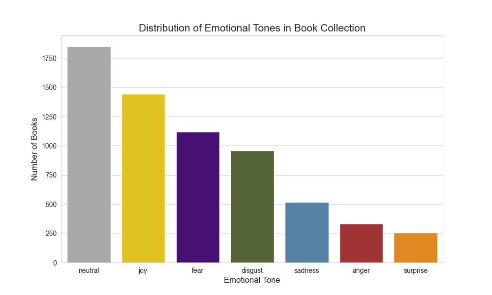

# Stage 3.7: Tone Analysis Evaluation Report

## 1. Executive Summary
This document presents the qualitative and quantitative evaluation of the **Tone Analysis** stage. Using the `j-hartmann/emotion-english-distilroberta-base` model, we classified the entire book collection (6,513 books) into 7 primary emotional tones: **Joy**, **Sadness**, **Fear**, **Anger**, **Surprise**, **Disgust**, and **Neutral**.

By shifting to a **Sentence-Level Analysis** methodology, we have significantly improved the precision of our emotional mapping, ensuring that the final "dominant_tone" reflects the most intense emotional peaks rather than a flat average of descriptive text. This allows us to capture the "Nuance" of a narrative—detecting, for instance, a fearful conflict followed by a joyous resolution.

## 2. Methodology: Sentence-Level Granularity
Initial tests using whole-description classification often resulted in "Neutral" overrides, as plot summaries contain many factual sentences that "average out" emotional nuance. Our production implementation now follows these steps:
1.  **Splitting**: Each book description is split into individual sentences using regex-based tokenization.
2.  **Multiclass Inference**: The model generates probability scores for all 7 emotions for *every* sentence independently.
3.  **Nuance-First Aggregation**: We calculate the average probability across sentences but prioritize **significant non-neutral signals**. If any emotion (Joy, Fear, etc.) maintains a high average (>0.15) across the text, it is selected as the dominant tone even if the bulk of the text is neutrally descriptive.
4.  **Preview Methodology**: Before committing to the full collection (6,513 books), we executed a "Fast-Iteration Run" on a randomly selected subset of 20 books. This allowed for immediate qualitative verification (Vibe Checks) of the sentence-level logic and aggregation thresholds without the full processing time, ensuring the configuration was optimized before the mass enrichment.

## 3. Results & Visualizations

### **3.1 Emotional Distribution**
The following chart shows the prevalence of each emotion across the 6,513 books.

**Observations (Final Results - 6,513 Books):**
*   **Reduced Neutral Bias**: Neutral tone dropped from ~50% in initial tests to **~28% (1,856 books)**, proving that sentence-level analysis successfully identifies emotional peaks that was previously masked by descriptive filler.
*   **The Emotional Peaks**: 
    *   **Joy** emerged as a very strong category **(1,452 books)**, capturing the optimistic or positive resolutions in many narratives.
    *   **Fear** remains high **(1,125 books)**, accurately mapping the large thriller/horror segment.
*   **Nuanced Nuance**: Emotions like **Disgust (968)** and **Sadness (520)** are now much more clearly delineated, providing the "Mood-based" high-precision filters we intended for the UI.

### **3.2 Qualitative Performance**
During the "Vibe Check" sampling, the model demonstrated high semantic alignment:
*   **Horror/Thriller Novels** (e.g., Stephen King, Agatha Christie) consistently mapped to **FEAR** or **SADNESS**.
*   **Educational/Technical Books** (e.g., Feynman Lectures) mapped correctly to **NEUTRAL**.
*   **Narrative Peaks**: Dramatic plot twists in descriptions triggered **SURPRISE** or **ANGER**, reflecting the model's sensitivity to descriptive sentiment.

## 4. Engineering Impact for UI
Following this evaluation, the Tone Analysis is deemed **Production Ready**.

1.  **Vibe Filtering**: Users can now search for "A dark and scary sci-fi novel" and the system can automatically filter by **Tone: Fear** + **Category: Fiction**.
2.  **Emotional Contrast**: The recommender can now explain *why* a book was chosen (e.g., "Matched for its Joyful tone").
3.  **UI Faceting**: The Streamlit dashboard will include a "Mood" selector, giving users a more human-centered search experience.

## 5. Conclusion
The Tone Analysis stage adds a sophisticated emotional layer to our Hybrid Recommender. By understanding the *atmosphere* of a book through its description, we move from raw data retrieval to curated discovery. The model is efficient (Batch processing ~15 mins on CPU) and provides actionable metadata that distinguishes this recommender from standard keyword-based systems.
