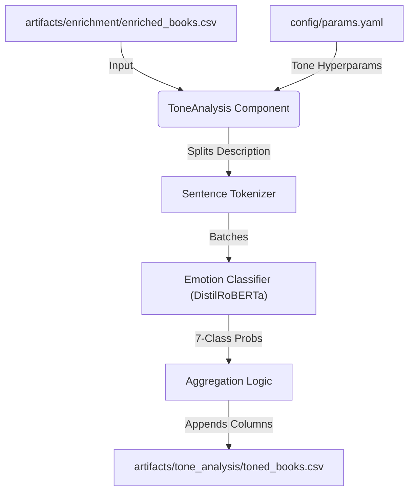

# Stage 3.8: Tone Analysis Report

## 1. Executive Summary
This document details the architectural design and operational logic of **Stage 3.8: Tone Analysis**. This component acts as the "Emotional Intelligence" layer of the pipeline, responsible for extracting granular emotional signals from book descriptions.

By moving beyond simple keyword matching or zero-shot categorization, this stage allows the recommendation engine to understand the *emotional journey* of a book (e.g., "Joyful", "Suspenseful/Fearful", "Sad/Melancholic"), enabling highly personalized "Outcome-Based" recommendations.

## 2. Architectural Design
The Tone Analysis architecture is designed for depth and nuance, favoring sentence-level precision over document-level generalization.

### **The Analysis Flow**

### **Component Interaction**
The process is orchestrated via the standard pipeline layers:

1.  **Configuration Layer (`src/entity/config_entity.py`)**:
    *   **Role:** Defines the `ToneAnalysisConfig` schema.
    *   **Attributes:** `model_name` (default: `j-hartmann/emotion-english-distilroberta-base`), `target_emotions` (7 classes), `batch_size`.

2.  **Logic Layer (`src/components/tone_analysis.py`)**:
    *   **Role:** The "Emotional Encoder."
    *   **Responsibilities:**
        *   **Sentence Splitting:** Uses robust regex to split descriptions into granular sentences, avoiding the noise of long-context tokenization.
        *   **Classification:** Runs a 7-class emotion classifier on *each sentence*.
        *   **Aggregation:** Calculates the **Mean Probability** for every emotion across all sentences.
        *   **Dominant Tone:** Identifies the strongest non-neutral emotion (with a threshold > 0.15).

3.  **Output Layer**:
    *   **Result:** A CSV containing the original metadata plus 8 new columns: `dominant_tone`, `joy`, `sadness`, `anger`, `fear`, `surprise`, `disgust`, `neutral`.

## 3. Implementation Strategy

### **Granular "Sentence-First" Approach**
Unlike traditional sentiment analysis that gives a single positive/negative score for a whole document, our approach recognizes that a book description is a journey.
*   *Why?* A description might start with **Fear** (the conflict) but end with **Joy** (the resolution).
*   *How?* We classify sentences individually (e.g., "The dragon roared" -> Fear: 0.9) and then average these probabilities. This captures the "Atmospheric Weight" of each emotion throughout the text.

### **Granular Probability Storage**
Crucially, we do not just store the "Winner" (Dominant Tone). We store the **Raw Probability** for every emotion.
*   **Significance:** This enables "Soft Sorting" in the inference stage. A book might be primarily "Neutral" (0.5), but have a significant "Joy" component (0.3). By storing the 0.3, we can still recommend it when a user asks for "Happy" books, sorting it by that specific probability.

## 4. DVC Orchestration
The tone analysis is a computationally intensive offline stage, tracked by DVC:
*   **Dependencies:** `artifacts/enrichment/enriched_books.csv` and the `model_name` parameter.
*   **Reproducibility:** Ensuring that the same model version and aggregation logic are used prevents "Emotional Drift" in recommendations between pipeline runs.
*   **Output:** `artifacts/tone_analysis/toned_books.csv`, which becomes the "Gold Standard" metadata source for the final inference engine.
